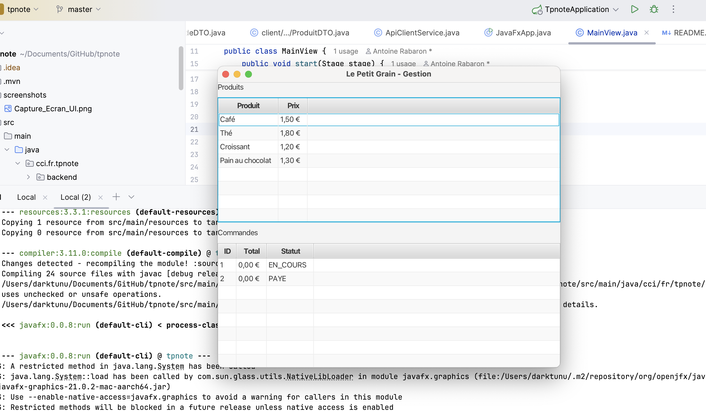

# TP Java — Le Petit Grain

## Client JavaFX & Backend Spring Boot

### Présentation du projet

Ce projet consiste à développer une application de gestion de commandes pour le café Le Petit Grain.
L’application permet au personnel du café de consulter les produits, suivre les commandes existantes et mettre à jour leur statut.

#### L’architecture repose sur :
- un Backend REST Spring Boot
- un Client JavaFX consommant l’API via HTTP
- un stockage en mémoire (sans base de données)

### Architecture technique
- Backend (Spring Boot)
- API REST
- Repository en mémoire
- Logique métier centralisée dans des services
- Utilisation de DTO pour exposer les données au client

### Endpoints principaux :
- GET /produits
- GET /produits/{id}
- GET /commandes
- GET /commandes/{id}
- POST /commandes
- PUT /commandes/{id}/statut
- Client (JavaFX)

### Le client JavaFX permet :
- d’afficher la liste des produits (nom, prix)
- d’afficher la liste des commandes (id, total, statut)
- de consulter le détail d’une commande
- de mettre à jour le statut d’une commande

### Choix d’implémentation de l’interface

L’interface JavaFX est construite directement en code Java.
FXML n’a pas été utilisé afin de simplifier l’architecture du client,
le sujet n’imposant pas son utilisation.

Ce choix permet de se concentrer sur les interactions REST, la logique métier et la réactivité de l’interface, tout en conservant une UI claire et fonctionnelle.

### Fonctionnalités implémentées

#### US1 — Consulter les produits
- Récupération via GET /produits
- Affichage du nom et du prix
- Prix formatés correctement (ex : 2.20 €)

#### US2 — Consulter les commandes
- Récupération via GET /commandes
- Affichage de l’identifiant, du total et du statut
- Consultation du détail via GET /commandes/{id}

#### US4 — Mettre à jour le statut d’une commande
- Mise à jour via PUT /commandes/{id}/statut

#### Transitions autorisées :
- EN_COURS → PAYE
- EN_COURS → ANNULE
- Transitions invalides bloquées par la logique métier

### Lancement du projet
#### Backend
mvn spring-boot:run

#### Client JavaFX
mvn javafx:run

### Captures d’écran
